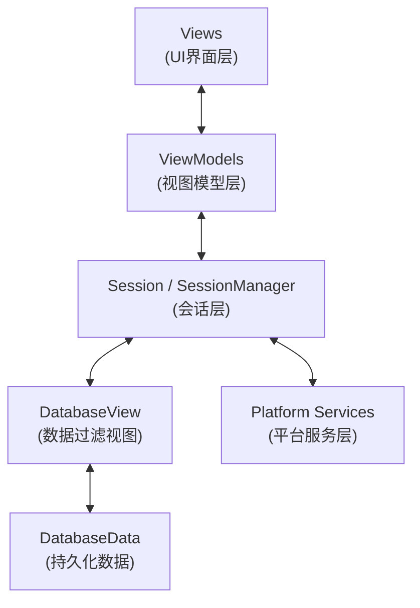

# 象棋笔记本 (XiangqiNotebook)

[](https://opensource.org/licenses/MIT)
[](https://developer.apple.com/swift/)
[](https://swift.org)

一个象棋学习和复习工具，支持 iPhone、iPad 和 Mac 三平台统一体验。

定位是笔记本，主要是记录和复习功能。macOS 版内置 Pikafish 引擎，支持局面评估。

## 快速开始

### 系统要求

- macOS 14.0+ / iOS 18.0+ / iPadOS 18.0+
- Xcode 15.0+
- Swift 5.0+

### 构建与运行

1. 克隆仓库：
```bash
git clone https://github.com/gooooloo/XiangqiNotebook.git
cd XiangqiNotebook
```

2. 打开 Xcode 项目：
```bash
open XiangqiNotebook.xcodeproj
```

3. 选择目标平台（iPhone、iPad 或 Mac）并运行

**注意**：首次打开项目时，需要配置代码签名：

方法 1（通过 Xcode UI）：
- 选择项目设置 → Signing & Capabilities
- 在 Team 下拉菜单中选择你的开发者账号

方法 2（通过配置文件）：
- 创建 `Config/Signing.local.xcconfig` 文件
- 添加你的 Team ID：`DEVELOPMENT_TEAM = YOUR_TEAM_ID`
- 该文件已在 `.gitignore` 中，不会被提交到仓库

## 三平台支持实现

### 技术实现方式

本项目基于 SwiftUI 统一 UI 框架开发，通过条件编译实现平台特定功能，在保持核心业务逻辑共享的同时，为不同平台提供差异化的用户体验。

### 平台特色

- **iPhone**: 便携式查看和学习，触控操作优化，简洁界面设计
- **iPad**: 大屏幕体验，支持多任务操作，介于手机和桌面之间的完整功能
- **Mac**: 专业分析工具，完整键盘操作支持，多窗口管理，适合深度学习

## 主要功能点

- **交互**: 支持鼠标操作。VIM 党后遗症。
- **棋谱管理**: 所有棋谱在一个库里，方便看到所有演变，方便总揽大局。
- **路径标记**: 每个局面都可以标记点和线。标记自动保存，下次打开还能看到。一次标记，永久复习。
- **局面分数**: 保存每个局面的分数（分数是通过点击按钮，自动联网去云库查询，而得到的）。
- **书签系统**: 重要局面的快速访问
- **注释功能**: 每个局面和着法都可以单独注释。一步着法不好，还可专门记录“不好”的原因，方便理解记忆。
- **练习模式**: 你执一方，电脑作为另一方，在多种应招下随机出招。方便单人练习各路演变。
- **统计分析**: 详细的对局数据统计和趋势分析
- **实战记录**: 记录个人对局的完整记录和回顾

## 文件目录结构（当前）

```
XiangqiNotebook/
├── XiangqiNotebookApp.swift
├── XiangqiNotebook.entitlements
├── Info.plist
├── Assets.xcassets/
├── Models/                 # 核心数据与会话层
│   ├── Database.swift
│   ├── DatabaseData.swift
│   ├── DatabaseView.swift  # 过滤视图
│   ├── Session.swift
│   ├── SessionData.swift
│   ├── SessionManager.swift
│   ├── GameOperations.swift
│   ├── FenObject.swift
│   ├── Move.swift
│   ├── MoveRules.swift
│   ├── Utils.swift
│   └── …
├── ViewModels/             # 视图模型与业务封装
│   ├── ViewModel.swift
│   ├── BoardViewModel.swift
│   ├── ActionDefinitions.swift
│   └── BoardUtils.swift
├── Views/                  # 用户界面层
│   ├── board/
│   │   ├── Board.swift
│   │   ├── PathView.swift
│   │   ├── PathMarkingBoard.swift
│   │   └── XiangqiImage.swift
│   ├── iOS/
│   │   ├── iPhoneContentView.swift
│   │   ├── iPadContentView.swift
│   │   └── …
│   └── Mac/
│       ├── MacContentView.swift
│       ├── GameBrowserView.swift
│       ├── MacPathEditorView.swift
│       ├── ReferenceBoardWindowController.swift
│       └── SearchResultsWindowController.swift
└── Services/               # 平台服务抽象
    ├── iOSPlatformService.swift
    └── MacOSPlatformService.swift
```

## 代码架构交互

### 分层访问规则

项目严格遵循分层架构原则，各层只能单向依赖：

- **Views 层**：只能访问 ViewModels，禁止直接访问 Models
- **ViewModels 层**：作为中介层，协调 Views、Models 和 Services
- **Models 层**：独立的数据层，通过 ObservableObject 通知变化
- **Services 层**：通过协议抽象，实现平台特定功能

### 数据流向图



### 各层职责

- **Views**：UI 展示与交互；通过 `@StateObject var viewModel` 与业务解耦
- **ViewModels**：封装应用用例；转调 `SessionManager/Session` 与 `PlatformService`
- **Session/SessionManager**：管理会话状态与操作编排（切换过滤、加载棋局/书签等）
- **DatabaseView**：对 `Database` 的过滤视图，统一封装所有基于 `fenId` 的访问
- **DatabaseData**：持久化数据（FenObject/Move/Game/Book 等）与索引
- **Services**：平台抽象服务，处理文件操作、系统弹窗等平台差异

## 技术架构

- **开发语言**: Swift + SwiftUI
- **架构模式**: MVVM (Model-View-ViewModel)
- **数据存储**: 本地持久化存储 + iCloud 数据同步

## 开发指南

详细的开发文档请参见：
- [CLAUDE.md](CLAUDE.md) - 完整的开发指南和架构说明
- [CONTRIBUTING.md](CONTRIBUTING.md) - 贡献指南
- [PRIVACY_POLICY.md](PRIVACY_POLICY.md) - 隐私政策

### 运行测试

```bash
# 运行所有测试
xcodebuild test -project XiangqiNotebook.xcodeproj -scheme XiangqiNotebook -destination 'platform=macOS'

# 运行特定测试类
xcodebuild test -project XiangqiNotebook.xcodeproj -scheme XiangqiNotebook -destination 'platform=macOS' -only-testing:XiangqiNotebookTests/TestClassName
```

## 贡献

欢迎贡献！请查看 [CONTRIBUTING.md](CONTRIBUTING.md) 了解如何参与项目开发。

## 许可证

本项目采用 MIT 许可证 - 详见 [LICENSE](LICENSE) 文件。

## 联系方式

- **GitHub Issues**: [提交问题或建议](https://github.com/gooooloo/XiangqiNotebook/issues)
- **隐私相关**: 请查看 [PRIVACY_POLICY.md](PRIVACY_POLICY.md)
